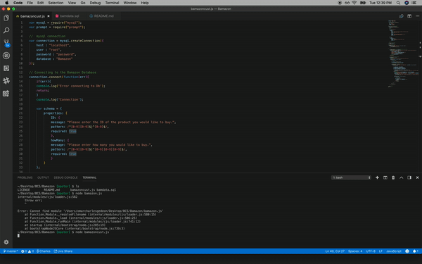

# Bamazon


<div>


I created an Amazon-like storefront app, called Bamazon, using MySQL, the MySQL NPM Package, and the Prompt Package.

This app takes in orders from customers and deplete from the store's total supplies.

The app first displays a list of all of the available products, their costs, and current stock.

The app asks the following things from the user.

    - The Product ID
    - The amount the user wants to purchase 
    - The app will display the stock before of the item before your purchase. 
    - What you are buying? 
    - How many?
    - And the unit cost.

Then it will display the total cost and ask if you would like to purchase another item.


### Setup


We'll leave that up to you -- however you like. Just make sure you're using Firebase to store data, GitHub to backup your project, and GitHub Pages to host your finished site.

Demo of Bamazon:




### Instructions to use this app

Bamazon must be run in the command line.

You will need to install the following in your terminal:

    - fs package in node
    - prompt
    - mysql

You can do this by typing in the following:

    - npm install
    - npm install prompt
    - npm install mysql

Then type in node bamazoncust.js to start the app.


### Languages Used:

```css

    - MySqul
    - Terminal (Bash)

```
### Commets:
I enjoyed working on this assignment. It was harder then I had anticipated. Big fan of working in my Terminal.

```css


[Link to Project](https://github.com/OCGedeon/Bamazon.git)


